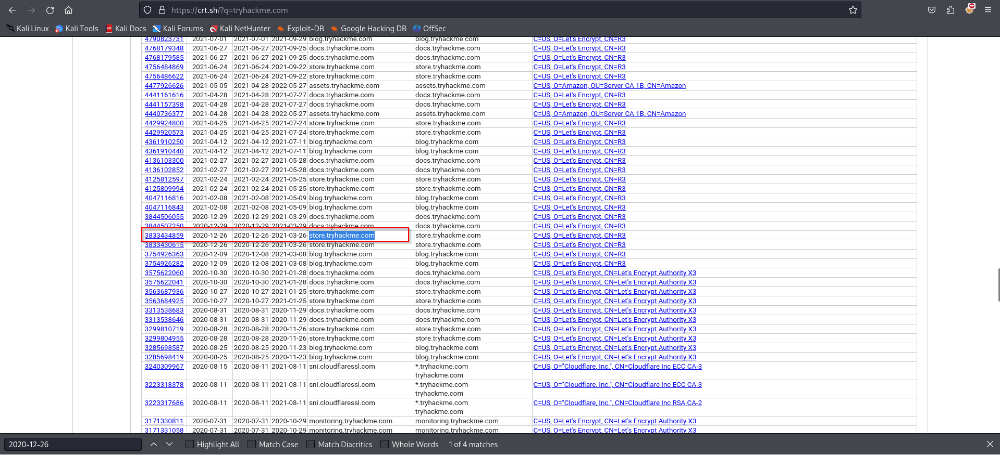
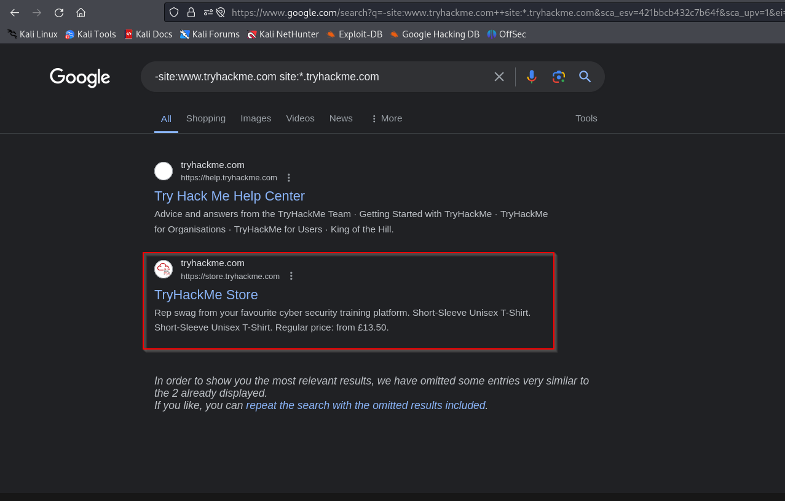
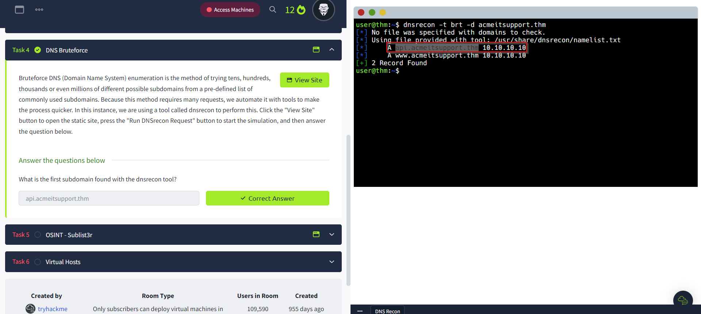
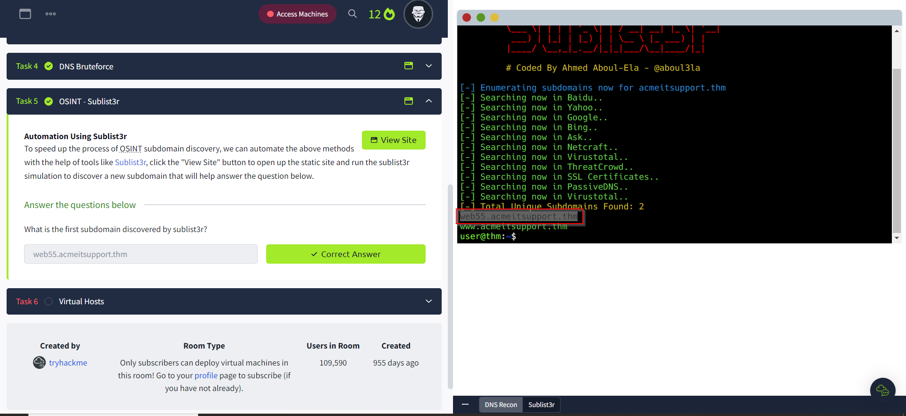
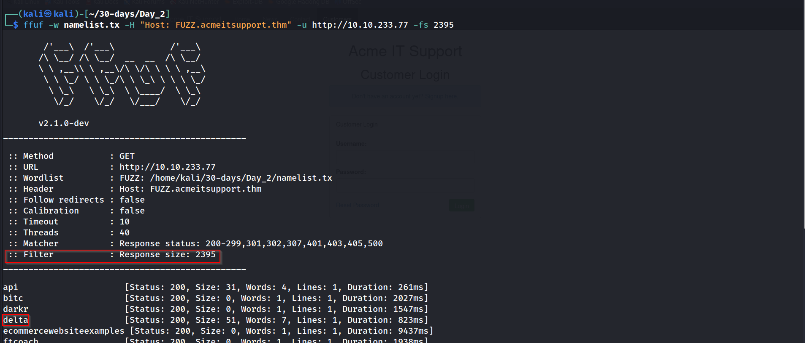
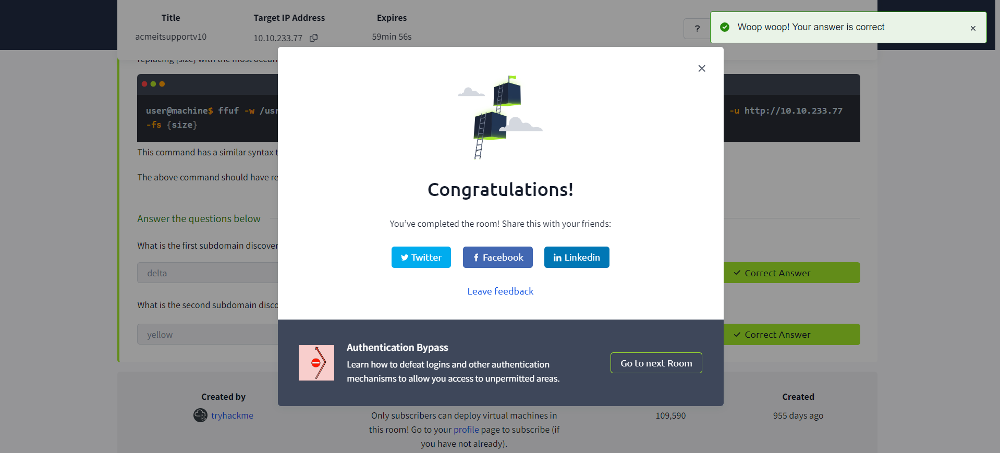

---
name:
  - machine1
Date: 14 April 2024
Platform: web
Category: paid
Difficulty: easy
tags:
  - THM
Status: solve
IP: 10.10.233.77
---

## Task 1 Brief

#### What is a subdomain enumeration method beginning with B?
`Brute Force`
#### What is a subdomain enumeration method beginning with O?
 `OSINT`
#### What is a subdomain enumeration method beginning with V?
`Virtual Host`
## Task 2 ONIST - SSL/TLS Certificates
#### What domain was logged on crt.sh at 2020-12-26?

`store.tryhackme.com`
## Task 3 OSINT - Search Engines
#### What is the TryHackMe subdomain beginning with `S` discovered using the above Google search?

`store.tryhackme.com`
## Task 4 DNS Bruteforce
#### What is the first subdomain found with the dnsrecon tool?

`api.acmeitsupport.thm`
## Task 5 OSINT - Sublist3r
#### What is the first subdomain discovered by sublist3r?

`web55.acmeitsupport.thm`
## Task 6Virtual Hosts

#### What is the first subdomain discovered?
`delta`
#### What is the second subdomain discovered?
`yellow`

