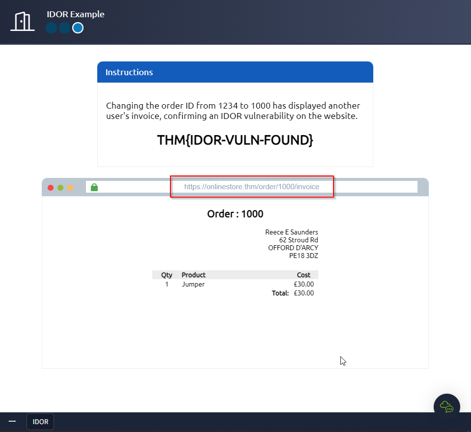

---
name:
  - IDOR
Date: 12 April 2024
Platform: web
Category: paid
Difficulty: easy
tags:
  - THM
Status: inprocess
IP:
---
### Task 1 What is an IDOR?
#### What does IDOR stand for?
```
insecure direct object reference
```
### Task 2An IDOR Example
#### What is the Flag from the IDOR example website?

```
THM{IDOR-VULN-FOUND}
```
#### Task 3 Finding IDORs in Encoded IDs
