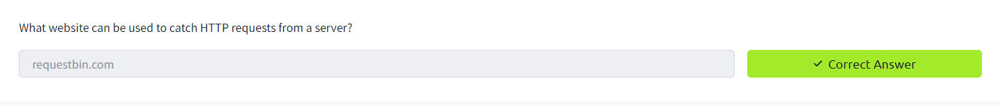

---
name:
  - Server-side request forgety
Date: 15 April 2024
Platform: web
Category: paid
Difficulty: easy
tags:
  - THM
Status: solve
IP:
---
## Task 1 What is an SSRF?

#### What does SSRF stand for?

 `Server-Side Request Forgery` 
#### As opposed to a regular SSRF, what is the other type?

`Blind`
## Task 2 SSRF Examples

#### What is the flag from the SSRF Examples site?


Using what you've learnt, try changing the address in the browser below to force the webserver to return data from **https://server.website.thm/flag?id=9**. To make things easier the **Server Requesting** bar at the bottom of the mock browser will show the URL that website.thm is requesting.

```
https://website.thm/item/2?server=server=website.thm/flag?id=9&x=2
```
#### What is the flag from the SSRF Examples site?
`THM{SSRF_MASTER}`

## Task 3 Finding an SSRF

#### What website can be used to catch HTTP requests from a server?

`requestbin.com`

## Task 4 Defeating Common SSRF Defenses

#### Open Redirect

An open redirect is an endpoint on the server where the website visitor gets automatically redirected to another website address. Take, for example, the link [https://website.thm/link?url=https://tryhackme.com](https://website.thm/link?url=https://tryhackme.com). This endpoint was created to record the number of times visitors have clicked on this link for advertising/marketing purposes.

#### What method can be used to bypass strict rules?
 `Open Redirect`
#### What IP address may contain sensitive data in a cloud environment?
 `169.254.169.254`
#### What type of list is used to **permit** only certain input?
`Allow List`
#### What type of list is used to **stop** certain input?
`Deny List`
## Task 5 SSRF Practical

#### What is the flag from the /private directory?

`THM{YOU_WORKED_OUT_THE_SSRF}`