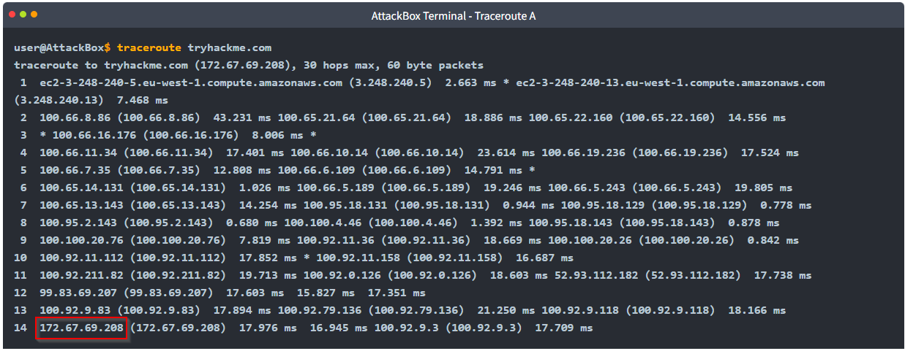
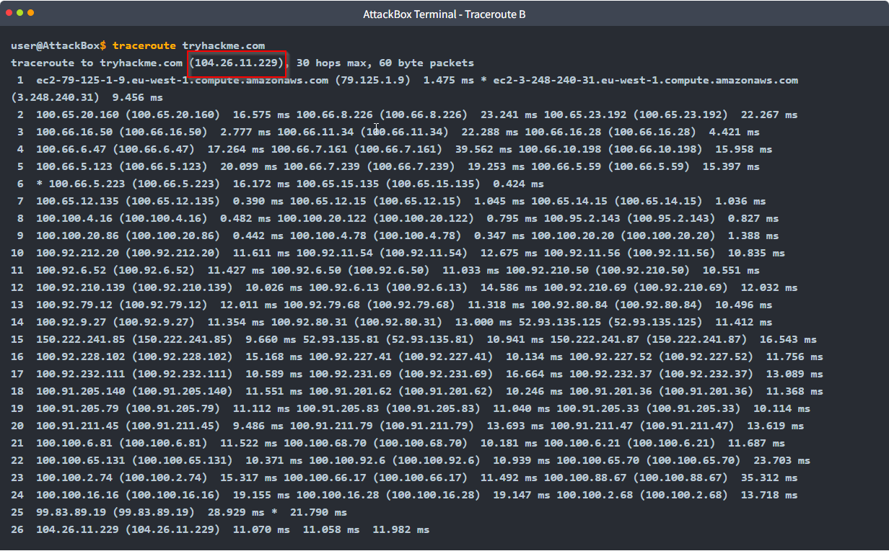
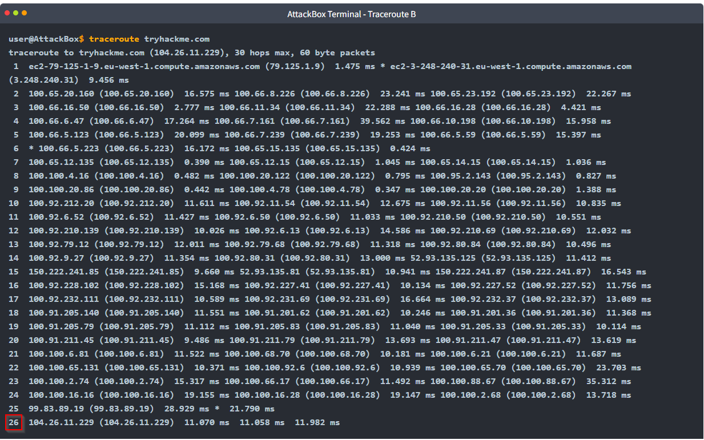
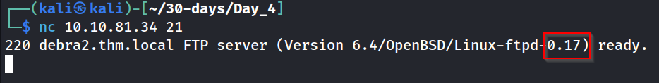

---
name:
  - Active Recon
Date: 16 April 2024
Platform: network
Category: free
Difficulty: easy
tags:
  - THM
Status: inprocess
IP:
---
## Task 2 Web Browser
The web browser can be a convenient tool, especially that it is readily available on all systems. There are several ways where you can use a web browser to gather information about a target.
[](https://github.com/shoulderhu/gitbook-tryhackme/blob/master/module/network-security/active-reconnaissance.md#task-2-web-browser)

#### Browse to the [following website](https://static-labs.tryhackme.cloud/sites/networking-tcp/) and ensure that you have opened your Developer Tools on AttackBox Firefox, or the browser on your computer. Using the Developer Tools, figure out the total number of questions.
## Task 3 Ping
Ping should remind you of the game ping-pong (table tennis). You throw the ball and expect to get it back. The primary purpose of ping is to check whether you can reach the remote system and that the remote system can reach you back. In other words, initially, this was used to check network connectivity; however, we are more interested in its different uses: checking whether the remote system is online.
#### Which option would you use to set the size of the data carried by the ICMP echo request?
	
#### What is the size of the ICMP header in bytes?

#### Does MS Windows Firewall block ping by default? (Y/N)

#### Deploy the VM for this task and using the AttackBox terminal, issue the command `ping -c 10 10.10.32.107`. How many ping replies did you get back?

## Task 4 Traceroute
As the name suggests, the traceroute command _traces the route_ taken by the packets from your system to another host. The purpose of a traceroute is to find the IP addresses of the routers or hops that a packet traverses as it goes from your system to a target host. This command also reveals the number of routers between the two systems. It is helpful as it indicates the number of hops (routers) between your system and the target host. However, note that the route taken by the packets might change as many routers use dynamic routing protocols that adapt to network changes.
#### In Traceroute A, what is the IP address of the last router/hop before reaching tryhackme.com?

#### In Traceroute B, what is the IP address of the last router/hop before reaching tryhackme.com?

#### In Traceroute B, how many routers are between the two systems?

## Task 5 Telnet
The TELNET (Teletype Network) protocol was developed in 1969 to communicate with a remote system via a command-line interface (CLI). Hence, the command `telnet` uses the TELNET protocol for remote administration. The default port used by telnet is 23. From a security perspective, `telnet` sends all the data, including usernames and passwords, in cleartext. Sending in cleartext makes it easy for anyone, who has access to the communication channel, to steal the login credentials. The secure alternative is SSH (Secure SHell) protocol.
#### Start the attached VM from Task 3 if it is not already started. On the AttackBox, open the terminal and use the telnet client to connect to the VM on port 80. What is the name of the running server?


What is the version of the running server (on port 80 of the VM)?
```
2.4.10
```
## Task 6  Netcat
Netcat or simply `nc` has different applications that can be of great value to a pentester. Netcat supports both TCP and UDP protocols. It can function as a client that connects to a listening port; alternatively, it can act as a server that listens on a port of your choice. Hence, it is a convenient tool that you can use as a simple client or server over TCP or UDP.
#### Start the VM and open the AttackBox. Once the AttackBox loads, use Netcat to connect to the VM port 21. What is the version of the running server?

