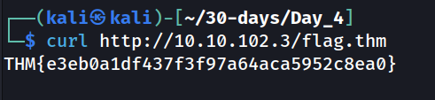
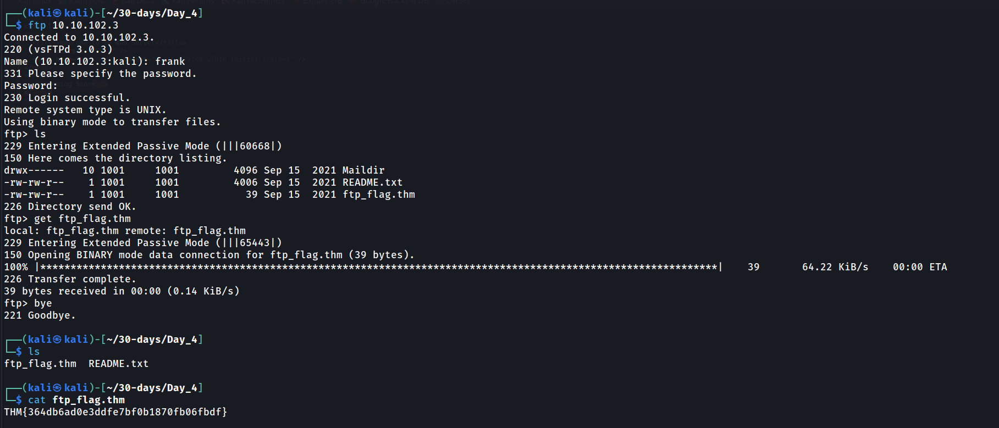
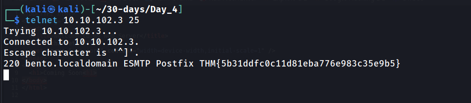
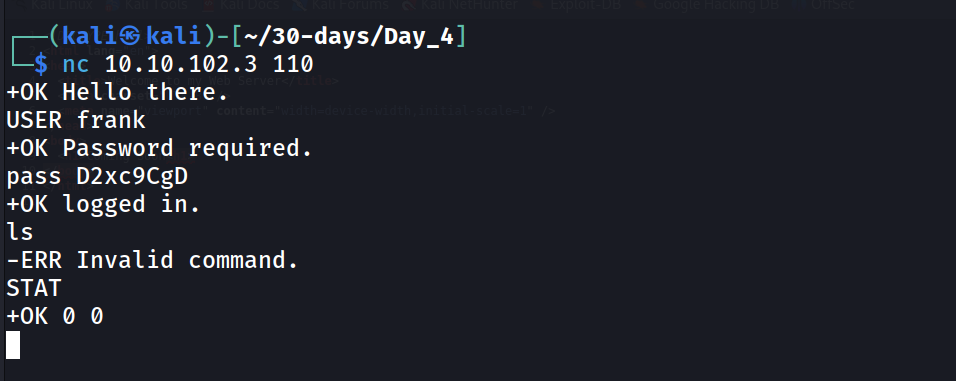

---
name:
  - precools and servers
Date: 16 April 2024
Platform: Linux
Category: paid
Difficulty: easy
tags:
  - THM
Status: solve
IP:
---
## Task 2 Telnet
The Telnet protocol is an application layer protocol used to connect to a virtual terminal of another computer. Using Telnet, a user can log into another computer and access its terminal (console) to run programs, start batch processes, and perform system administration tasks remotely.

Telnet protocol is relatively simple. When a user connects, they will be asked for a username and password. Upon correct authentication, the user will access the remote system’s terminal. Unfortunately, all this communication between the Telnet client and the Telnet server is not encrypted, making it an easy target for attackers.

A Telnet server uses the Telnet protocol to listen for incoming connections on port 23. (Please note that the Telnet port is not open on the target VM.) Let’s consider the example shown below. A user is connecting to the `telnetd`, a Telnet server. The steps are as follows:
#### To which port will the `telnet` command with the default parameters try to connect?
```
23
```
## Task 3 Hypertext Transfer Protocol (HTTP)
#### Launch the attached VM. From the AttackBox terminal, connect using Telnet to `10.10.102.3 80` and retrieve the file `flag.thm`. What does it contain?

## Task 4 File Transfer Protocol (FTP)
File Transfer Protocol (FTP) was developed to make the transfer of files between different computers with different systems efficient.

FTP also sends and receives data as cleartext; therefore, we can use Telnet (or Netcat) to communicate with an FTP server and act as an FTP client. In the example below, we carried out the following steps:

## Task 5 Simple Mail Transfer Protocol (SMTP)
Email is one of the most used services on the Internet. There are various configurations for email servers; for instance, you may set up an email system to allow local users to exchange emails with each other with no access to the Internet. However, we will consider the more general setup where different email servers connect over the Internet.

## Task 6 Post Office Protocol 3 (POP3)
Post Office Protocol version 3 (POP3) is a protocol used to download the email messages from a Mail Delivery Agent (MDA) server, as shown in the figure below. The mail client connects to the POP3 server, authenticates, downloads the new email messages before (optionally) deleting them.
#### Connect to the VM (`10.10.102.3`) at the POP3 port. Authenticate using the username `frank` and password `D2xc9CgD`. What is the response you get to `STAT`?

#### How many email messages are available to download via POP3 on `10.10.102.3`?
`0`
## Task 7 Internet Message Access Protocol (IMAP)
Internet Message Access Protocol (IMAP) is more sophisticated than POP3. IMAP makes it possible to keep your email synchronized across multiple devices (and mail clients). In other words, if you mark an email message as read when checking your email on your smartphone, the change will be saved on the IMAP server (MDA) and replicated on your laptop when you synchronize your inbox.
#### What is the default port used by IMAP?
```
143
```