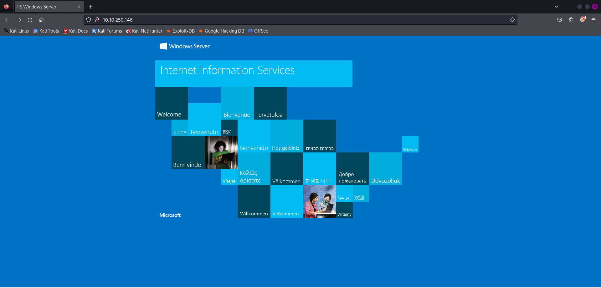
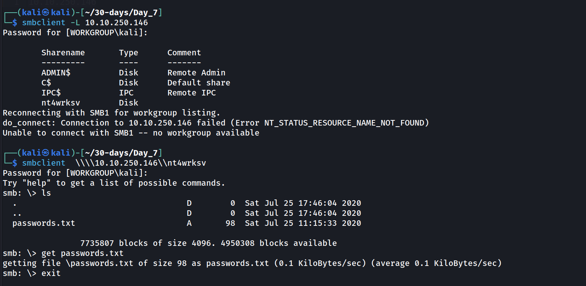
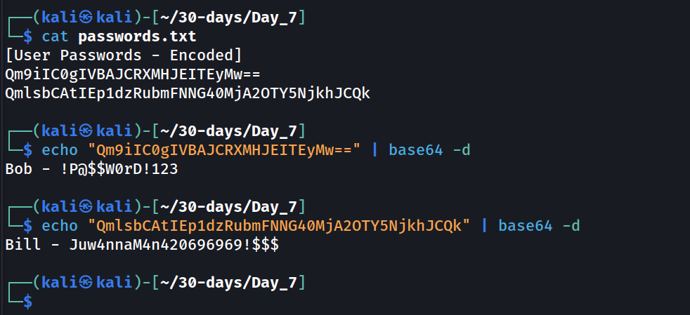

---
name:
  - Relevant
Date: 21 April 2024
Platform: windows
Category: paid
Difficulty: medium
tags:
  - THM
Status: inprocess
IP: http://10.10.250.146/
---

# Machine 


# Resolution summary
- Text
- Text

## Improved skills
- skill 1
- skill 2

## Used tools
- nmap
- gobuster

---

# Information Gathering
Scanned all TCP ports:
```bash
PORT     STATE SERVICE        VERSION
80/tcp   open  http           Microsoft IIS httpd 10.0
135/tcp  open  msrpc          Microsoft Windows RPC
139/tcp  open  netbios-ssn    Microsoft Windows netbios-ssn
445/tcp  open  microsoft-ds   Windows Server 2016 Standard Evaluation 14393 microsoft-ds
3389/tcp open  ms-wbt-server?

```

Enumerated open TCP ports:
```bash
PORT     STATE SERVICE        VERSION
80/tcp   open  http           Microsoft IIS httpd 10.0
|_http-server-header: Microsoft-IIS/10.0
|_http-title: IIS Windows Server
| http-methods: 
|_  Potentially risky methods: TRACE
135/tcp  open  msrpc          Microsoft Windows RPC
139/tcp  open  netbios-ssn    Microsoft Windows netbios-ssn
445/tcp  open  microsoft-ds   Windows Server 2016 Standard Evaluation 14393 microsoft-ds
3389/tcp open  ms-wbt-server?
| ssl-cert: Subject: commonName=Relevant
| Not valid before: 2024-04-19T22:13:39
|_Not valid after:  2024-10-19T22:13:39
|_ssl-date: 2024-04-20T22:16:54+00:00; +24s from scanner time.
| rdp-ntlm-info: 
|   Target_Name: RELEVANT
|   NetBIOS_Domain_Name: RELEVANT
|   NetBIOS_Computer_Name: RELEVANT
|   DNS_Domain_Name: Relevant
|   DNS_Computer_Name: Relevant
|   Product_Version: 10.0.14393
|_  System_Time: 2024-04-20T22:16:15+00:00
```
---

# Enumeration
## Port 80 - HTTP (Microsoft IIS httpd 10.0)
```
80/tcp   open  http           Microsoft IIS httpd 10.0
|_http-server-header: Microsoft-IIS/10.0
|_http-title: IIS Windows Server
| http-methods: 
|_  Potentially risky methods: TRACE
```

# Enumerating SMB
### port 445 - SMB (microsoft-ds   Windows Server 2016 Standard Evaluation 14393 microsoft-ds)




---

# Exploitation
## Name of the technique

---

# Privilege Escalation
## Local Enumeration


## Privilege Escalation vector


---

# Trophy & Loot
user.txt

root.txt