---
name:
  - "Game Zone\r"
Date: 21 April 2024
Platform: Linux
Category: paid
Difficulty: easy
tags:
  - THM
Status: inprocess
IP: 10.10.182.186
---

# Machine 


# Resolution summary
- Learn to hack into this machine. Understand how to use SQLMap, crack some passwords, reveal services using a reverse SSH tunnel and escalate your privileges to root!

## Improved skills
- skill 1
- skill 2

## Used tools
- nmap
- gobuster
- sqlmap
- metasploit

---

# Information Gathering
Scanned all TCP ports:
```bash
                                                                                                                                                                            
┌──(kali㉿kali)-[~/30-days/Day_8]
└─$ sudo nmap -sV -A -T4 -Pn 10.10.182.186
[sudo] password for kali: 
Starting Nmap 7.94SVN ( https://nmap.org ) at 2024-04-21 07:02 EDT
Stats: 0:00:30 elapsed; 0 hosts completed (1 up), 1 undergoing Traceroute
Traceroute Timing: About 32.26% done; ETC: 07:03 (0:00:00 remaining)
Nmap scan report for 10.10.182.186
Host is up (0.26s latency).
Not shown: 998 closed tcp ports (reset)
PORT   STATE SERVICE VERSION
22/tcp open  ssh     OpenSSH 7.2p2 Ubuntu 4ubuntu2.7 (Ubuntu Linux; protocol 2.0)
| ssh-hostkey: 
|   2048 61:ea:89:f1:d4:a7:dc:a5:50:f7:6d:89:c3:af:0b:03 (RSA)
|   256 b3:7d:72:46:1e:d3:41:b6:6a:91:15:16:c9:4a:a5:fa (ECDSA)
|_  256 53:67:09:dc:ff:fb:3a:3e:fb:fe:cf:d8:6d:41:27:ab (ED25519)
80/tcp open  http    Apache httpd 2.4.18 ((Ubuntu))
| http-cookie-flags: 
|   /: 
|     PHPSESSID: 
|_      httponly flag not set
|_http-server-header: Apache/2.4.18 (Ubuntu)
|_http-title: Game Zone
No exact OS matches for host (If you know what OS is running on it, see https://nmap.org/submit/ ).
TCP/IP fingerprint:
OS:SCAN(V=7.94SVN%E=4%D=4/21%OT=22%CT=1%CU=34754%PV=Y%DS=2%DC=T%G=Y%TM=6624
OS:F27D%P=x86_64-pc-linux-gnu)SEQ(SP=100%GCD=1%ISR=10D%TI=Z%CI=I%TS=8)SEQ(S
OS:P=100%GCD=1%ISR=10D%TI=Z%CI=I%II=I%TS=8)SEQ(SP=100%GCD=1%ISR=10E%TI=Z%CI
OS:=I%II=I%TS=8)SEQ(SP=100%GCD=2%ISR=10D%TI=Z%CI=I%II=I%TS=8)SEQ(SP=FF%GCD=
OS:1%ISR=10D%TI=Z%CI=I%II=I%TS=8)OPS(O1=M508ST11NW7%O2=M508ST11NW7%O3=M508N
OS:NT11NW7%O4=M508ST11NW7%O5=M508ST11NW7%O6=M508ST11)WIN(W1=68DF%W2=68DF%W3
OS:=68DF%W4=68DF%W5=68DF%W6=68DF)ECN(R=Y%DF=Y%T=40%W=6903%O=M508NNSNW7%CC=Y
OS:%Q=)T1(R=Y%DF=Y%T=40%S=O%A=S+%F=AS%RD=0%Q=)T2(R=N)T3(R=N)T4(R=Y%DF=Y%T=4
OS:0%W=0%S=A%A=Z%F=R%O=%RD=0%Q=)T5(R=Y%DF=Y%T=40%W=0%S=Z%A=S+%F=AR%O=%RD=0%
OS:Q=)T6(R=Y%DF=Y%T=40%W=0%S=A%A=Z%F=R%O=%RD=0%Q=)T7(R=Y%DF=Y%T=40%W=0%S=Z%
OS:A=S+%F=AR%O=%RD=0%Q=)U1(R=Y%DF=N%T=40%IPL=164%UN=0%RIPL=G%RID=G%RIPCK=G%
OS:RUCK=G%RUD=G)IE(R=Y%DFI=N%T=40%CD=S)

Network Distance: 2 hops
Service Info: OS: Linux; CPE: cpe:/o:linux:linux_kernel

TRACEROUTE (using port 23/tcp)
HOP RTT       ADDRESS
1   335.10 ms 10.8.0.1
2   335.24 ms 10.10.182.186

OS and Service detection performed. Please report any incorrect results at https://nmap.org/submit/ .
Nmap done: 1 IP address (1 host up) scanned in 48.21 seconds
```

Enumerated open TCP ports:
```bash

```

Enumerated top 200 UDP ports:
```bash

```

---

# Enumeration
## Port 80 - HTTP (Apache)

---

# Exploitation
#### Task 4 Cracking a password with JohnTheRipper
John the Ripper (JTR) is a fast, free and open-source password cracker. This is also pre-installed on all Kali Linux machines.

We will use this program to crack the hash we obtained earlier. JohnTheRipper is 15 years old and other programs such as HashCat are one of several other cracking programs out there. 

This program works by taking a wordlist, hashing it with the specified algorithm and then comparing it to your hashed password. If both hashed passwords are the same, it means it has found it. You cannot reverse a hash, so it needs to be done by comparing hashes.
#### 2 What is the de-hashed password?
```bash
┌──(kali㉿kali)-[~/30-days/Day_8]
└─$ echo "ab5db915fc9cea6c78df88106c6500c57f2b52901ca6c0c6218f04122c3efd14" > agent47.hash
```
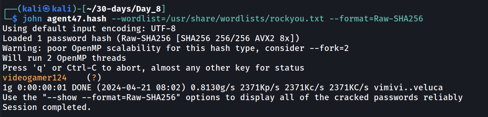
Answer: `videogamer124`
### 3 - Now you have a password and username. Try SSH’ing onto the machine. What is the user flag?
Let’s connect with `ssh agent47@10.10.182.186`.
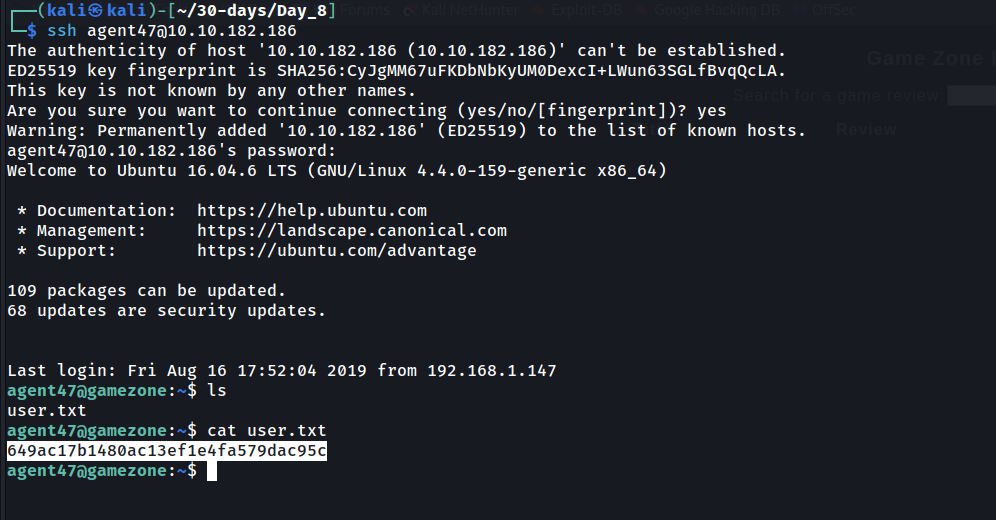


### Task 5 Exposing services with reverse SSH tunnels
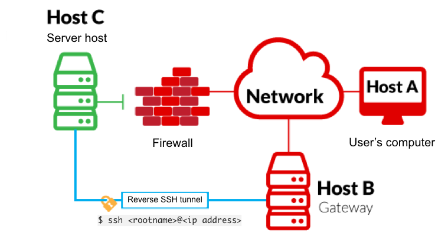
Reverse SSH port forwarding specifies that the given port on the remote server host is to be forwarded to the given host and port on the local side.

**-L** is a local tunnel (YOU <-- CLIENT). If a site was blocked, you can forward the traffic to a server you own and view it. For example, if imgur was blocked at work, you can do **ssh -L 9000:imgur.com:80 user@example.com.** Going to localhost:9000 on your machine, will load imgur traffic using your other server.

**-R** is a remote tunnel (YOU --> CLIENT). You forward your traffic to the other server for others to view. Similar to the example above, but in reverse.

We will use a tool called **ss** to investigate sockets running on a host.

If we run **ss -tulpn** it will tell us what socket connections are running

|              |                                    |
| ------------ | ---------------------------------- |
| **Argument** | **Description**                    |
| -t           | Display TCP sockets                |
| -u           | Display UDP sockets                |
| -l           | Displays only listening sockets    |
| -p           | Shows the process using the socket |
| -n           | Doesn't resolve service names      |
How many TCP sockets are running?

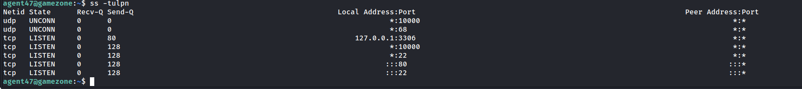

We can see that a service running on port 10000 is blocked via a firewall rule from the outside (we can see this from the IPtable list). However, Using an SSH Tunnel we can expose the port to us (locally)!
From our local machine, run `ssh -L 10000:localhost:10000 <username>@<ip>`

Once complete, in your browser type "localhost:10000" and you can access the newly-exposed webserver.
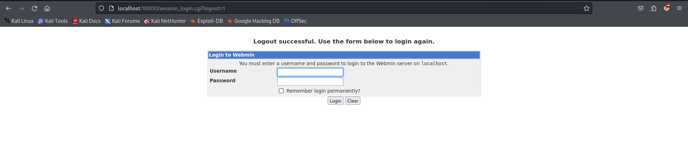
#### What is the name of the exposed CMS?
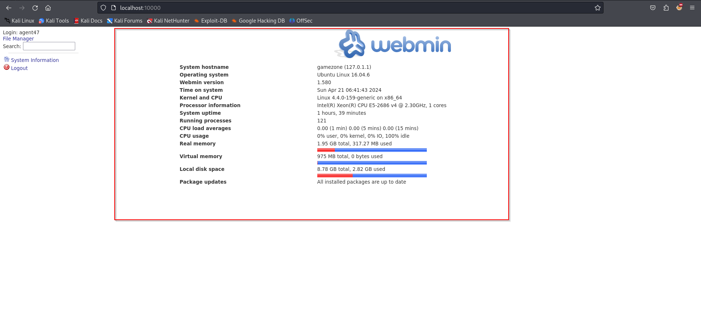
`webmin`
#### What is the CMS version?
`1.580`
### Task 6 Privilege Escalation with Metasploit
Using the CMS dashboard version, use Metasploit to find a payload to execute against the machine.
If you are inexperienced with Metasploit, complete the Metasploit room first
### 1 - What is the root flag?
Searching on Google for exploits affecting Webmin version 1.580, we find that the corresponding CVE is CVE-2012-2982 ([https://www.exploit-db.com/exploits/21851](https://www.exploit-db.com/exploits/21851)). Let’s search for CVE-2012-2982:
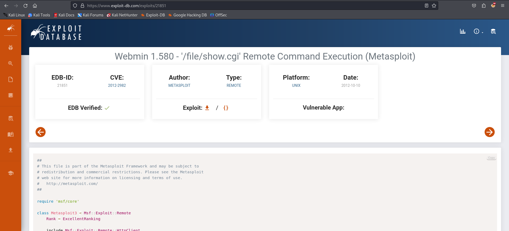
Using the CMS dashboard version, use Metasploit to find a payload to execute against the machine.
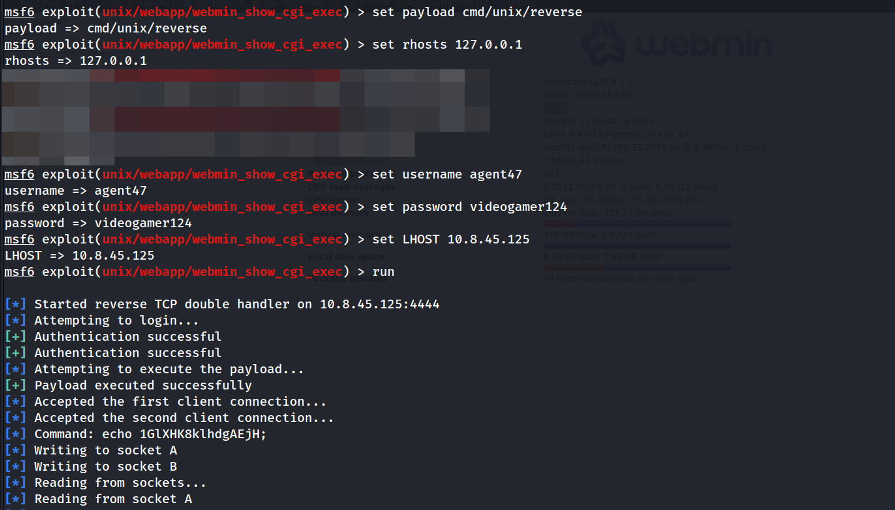
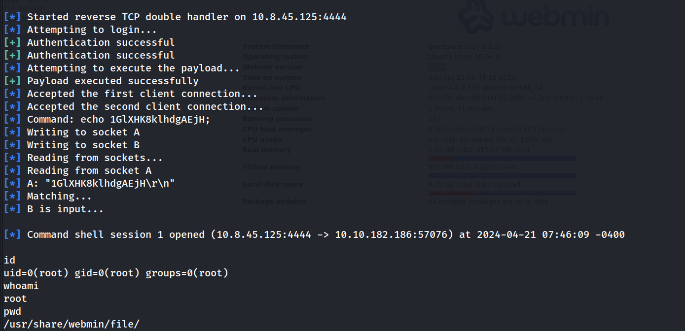
What is the root flag?
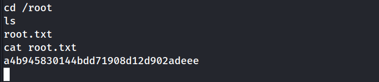

---
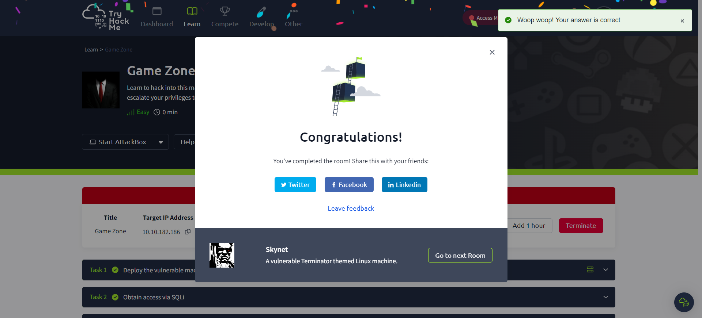
# Trophy & Loot
user.txt
```
649ac17b1480ac13ef1e4fa579dac95c
```

root.txt
```
a4b945830144bdd71908d12d902adeee
```