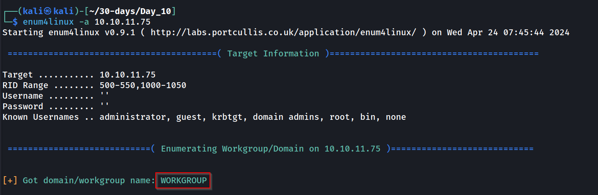
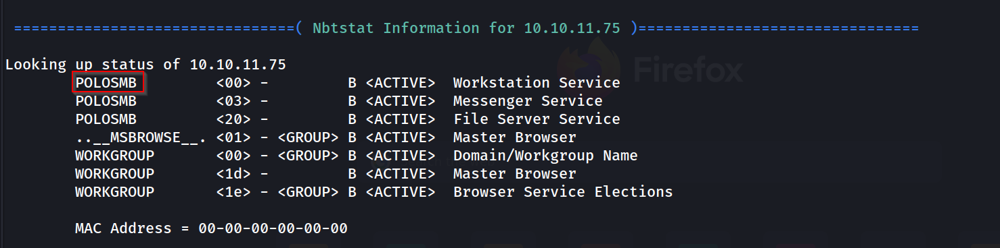
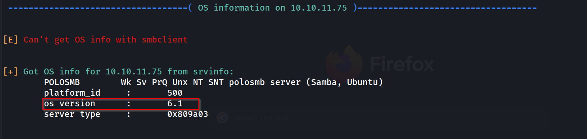
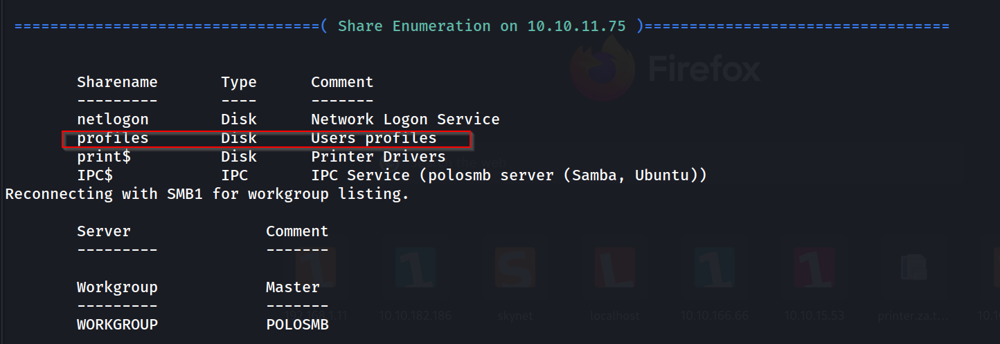
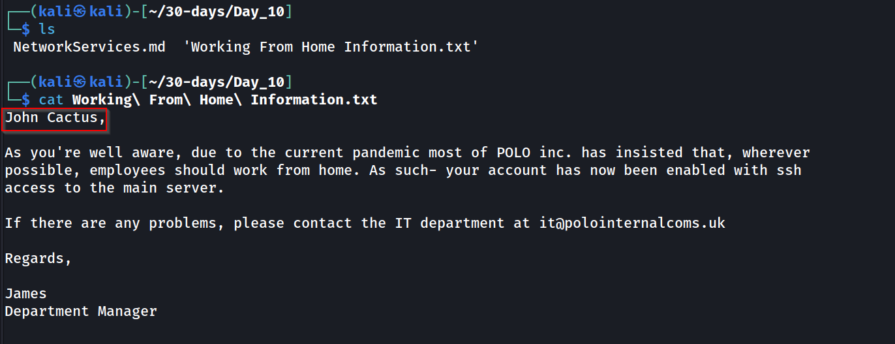
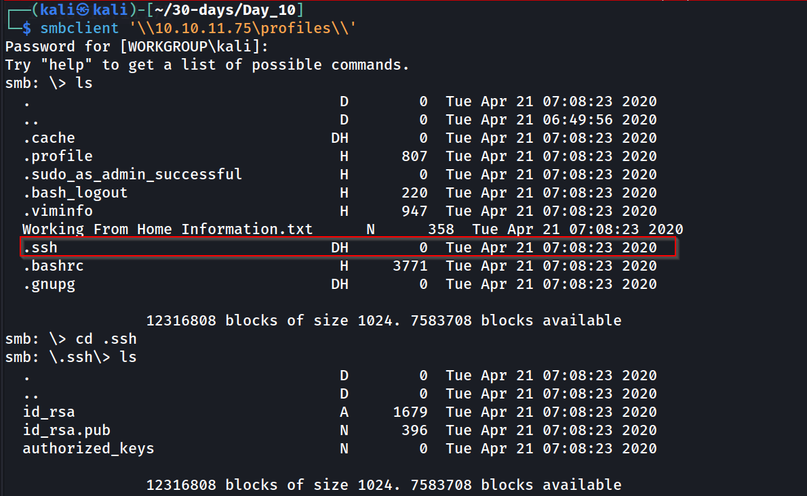
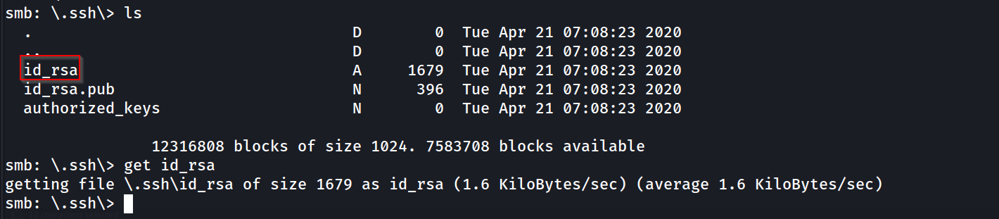
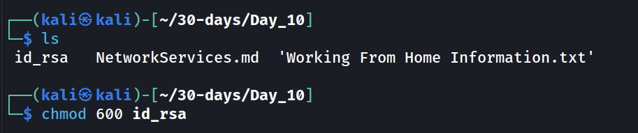
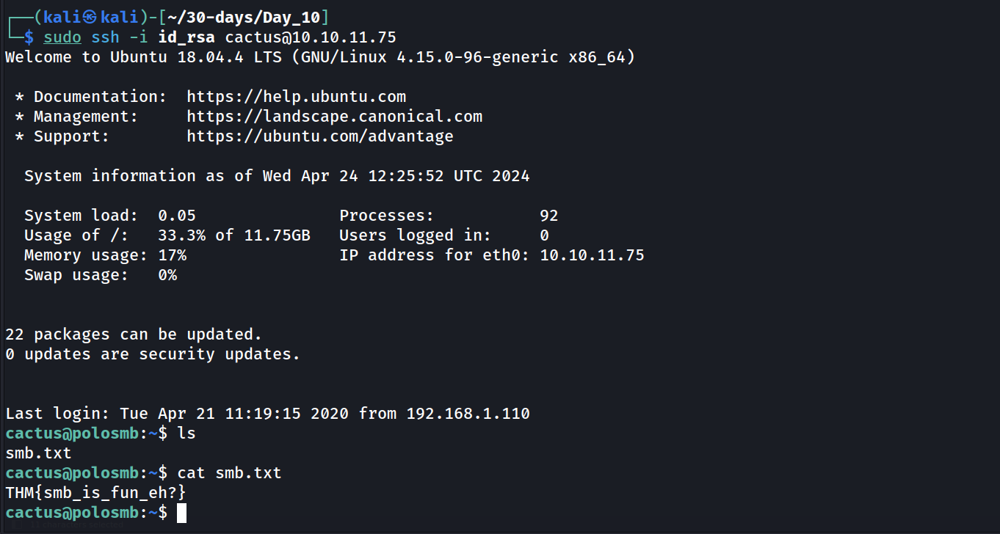

## Task 2 Understanding SMB

---
**What is SMB?**

SMB - Server Message Block Protocol - is a client-server communication protocol used for sharing access to files, printers, serial ports and other resources on a network. [[source](https://searchnetworking.techtarget.com/definition/Server-Message-Block-Protocol)]  

Servers make file systems and other resources (printers, named pipes, APIs) available to clients on the network. Client computers may have their own hard disks, but they also want access to the shared file systems and printers on the servers.

The SMB protocol is known as a response-request protocol, meaning that it transmits multiple messages between the client and server to establish a connection. Clients connect to servers using TCP/IP (actually NetBIOS over TCP/IP as specified in RFC1001 and RFC1002), NetBEUI or IPX/SPX.

**How does SMB work?**  


Once they have established a connection, clients can then send commands (SMBs) to the server that allow them to access shares, open files, read and write files, and generally do all the sort of things that you want to do with a file system. However, in the case of SMB, these things are done over the network.

**What runs SMB?**

Microsoft Windows operating systems since Windows 95 have included client and server SMB protocol support. Samba, an open source server that supports the SMB protocol, was released for Unix systems.
#### What does SMB stand for?      

Answer`server message block`
#### What type of protocol is SMB?      

answer`response-request`

---
#### What do clients connect to servers using?      

answer `tcp/ip`

---
#### What systems does Samba run on?
Answer`unix`

---
# Task 3 Enumerating SMB
---
**Lets Get Started**

Before we begin, make sure to deploy the room and give it some time to boot. Please be aware, this can take up to five minutes so be patient!

**Enumeration**

Enumeration is the process of gathering information on a target in order to find potential attack vectors and aid in exploitation.

This process is essential for an attack to be successful, as wasting time with exploits that either don't work or can crash the system can be a waste of energy. Enumeration can be used to gather usernames, passwords, network information, hostnames, application data, services, or any other information that may be valuable to an attacker.

**SMB**  

Typically, there are SMB share drives on a server that can be connected to and used to view or transfer files. SMB can often be a great starting point for an attacker looking to discover sensitive information — you'd be surprised what is sometimes included on these shares.  

**Port Scanning**

The first step of enumeration is to conduct a port scan, to find out as much information as you can about the services, applications, structure and operating system of the target machine.  

If you haven't already looked at port scanning, I **recommend** checking out the Nmap room [here](https://tryhackme.com/room/furthernmap).

**Enum4Linux**

Enum4linux is a tool used to enumerate SMB shares on both Windows and Linux systems. It is basically a wrapper around the tools in the Samba package and makes it easy to quickly extract information from the target pertaining to SMB. It's installed by default on Parrot and Kali, however if you need to install it, you can do so from the official [github](https://github.com/portcullislabs/enum4linux).

The syntax of Enum4Linux is nice and simple: **"enum4linux [options] ip"**  

**TAG**            **FUNCTION**  

-U             get userlist  
-M             get machine list  
-N             get namelist dump (different from -U and-M)  
-S             get sharelist  
-P             get password policy information  
-G             get group and member list

-a             all of the above (full basic enumeration)  

Now we understand our enumeration tools, let's get started!

---
#### Conduct an **nmap** scan of your choosing, How many ports are open?  

answer
```
┌──(kali㉿kali)-[~/30-days/Day_10]
└─$ sudo nmap -sV -A -T4 10.10.11.75                                                                                        
[sudo] password for kali: 
Starting Nmap 7.94SVN ( https://nmap.org ) at 2024-04-24 07:34 EDT
Nmap scan report for 10.10.11.75
Host is up (0.16s latency).
Not shown: 997 closed tcp ports (reset)
PORT    STATE SERVICE     VERSION
22/tcp  open  ssh         OpenSSH 7.6p1 Ubuntu 4ubuntu0.3 (Ubuntu Linux; protocol 2.0)
| ssh-hostkey: 
|   2048 91:df:5c:7c:26:22:6e:90:23:a7:7d:fa:5c:e1:c2:52 (RSA)
|   256 86:57:f5:2a:f7:86:9c:cf:02:c1:ac:bc:34:90:6b:01 (ECDSA)
|_  256 81:e3:cc:e7:c9:3c:75:d7:fb:e0:86:a0:01:41:77:81 (ED25519)
139/tcp open  netbios-ssn Samba smbd 3.X - 4.X (workgroup: WORKGROUP)
445/tcp open  netbios-ssn Samba smbd 4.7.6-Ubuntu (workgroup: WORKGROUP)
No exact OS matches for host (If you know what OS is running on it, see https://nmap.org/submit/ ).
TCP/IP fingerprint:
OS:SCAN(V=7.94SVN%E=4%D=4/24%OT=22%CT=1%CU=35916%PV=Y%DS=2%DC=T%G=Y%TM=6628
OS:EE80%P=x86_64-pc-linux-gnu)SEQ(SP=104%GCD=1%ISR=10C%TI=Z%CI=Z%II=I%TS=A)
OS:SEQ(SP=105%GCD=1%ISR=10D%TI=Z%CI=Z%II=I%TS=A)OPS(O1=M508ST11NW7%O2=M508S
OS:T11NW7%O3=M508NNT11NW7%O4=M508ST11NW7%O5=M508ST11NW7%O6=M508ST11)WIN(W1=
OS:F4B3%W2=F4B3%W3=F4B3%W4=F4B3%W5=F4B3%W6=F4B3)ECN(R=Y%DF=Y%T=40%W=F507%O=
OS:M508NNSNW7%CC=Y%Q=)T1(R=Y%DF=Y%T=40%S=O%A=S+%F=AS%RD=0%Q=)T2(R=N)T3(R=N)
OS:T4(R=Y%DF=Y%T=40%W=0%S=A%A=Z%F=R%O=%RD=0%Q=)T5(R=Y%DF=Y%T=40%W=0%S=Z%A=S
OS:+%F=AR%O=%RD=0%Q=)T6(R=Y%DF=Y%T=40%W=0%S=A%A=Z%F=R%O=%RD=0%Q=)T7(R=Y%DF=
OS:Y%T=40%W=0%S=Z%A=S+%F=AR%O=%RD=0%Q=)U1(R=Y%DF=N%T=40%IPL=164%UN=0%RIPL=G
OS:%RID=G%RIPCK=G%RUCK=G%RUD=G)IE(R=Y%DFI=N%T=40%CD=S)

Network Distance: 2 hops
Service Info: Host: POLOSMB; OS: Linux; CPE: cpe:/o:linux:linux_kernel

Host script results:
|_clock-skew: mean: 25s, deviation: 1s, median: 25s
| smb-security-mode: 
|   account_used: guest
|   authentication_level: user
|   challenge_response: supported
|_  message_signing: disabled (dangerous, but default)
|_nbstat: NetBIOS name: POLOSMB, NetBIOS user: <unknown>, NetBIOS MAC: <unknown> (unknown)
| smb2-time: 
|   date: 2024-04-24T11:35:48
|_  start_date: N/A
| smb-os-discovery: 
|   OS: Windows 6.1 (Samba 4.7.6-Ubuntu)
|   Computer name: polosmb
|   NetBIOS computer name: POLOSMB\x00
|   Domain name: \x00
|   FQDN: polosmb
|_  System time: 2024-04-24T11:35:48+00:00
| smb2-security-mode: 
|   3:1:1: 
|_    Message signing enabled but not required

TRACEROUTE (using port 8080/tcp)
HOP RTT       ADDRESS
1   192.58 ms 10.8.0.1
2   186.11 ms 10.10.11.75

OS and Service detection performed. Please report any incorrect results at https://nmap.org/submit/ .
Nmap done: 1 IP address (1 host up) scanned in 83.42 seconds

```
there are 3 open ports:
22,445,139
#### What ports is **SMB** running on?

answer`139/445`
#### Let's get started with Enum4Linux, conduct a full basic enumeration. For starters, what is the **workgroup** name?      

answer`WORKGROUP`

#### What comes up as the **name** of the machine?          

answer`POLOSMB`


#### What operating system **version** is running?      

answer `6.1`

#### What share sticks out as something we might want to investigate?

answer`profiles`



# Task 4 Exploiting SMB
---
**Types of SMB Exploit **

While there are vulnerabilities such as [CVE-2017-7494](https://www.cvedetails.com/cve/CVE-2017-7494/) that can allow remote code execution by exploiting SMB, you're more likely to encounter a situation where the best way into a system is due to misconfigurations in the system. In this case, we're going to be exploiting anonymous SMB share access- a common misconfiguration that can allow us to gain information that will lead to a shell.  

**Method Breakdown**

So, from our enumeration stage, we know:

    - The SMB share location

    - The name of an interesting SMB share  

**SMBClient**

Because we're trying to access an SMB share, we need a client to access resources on servers. We will be using SMBClient because it's part of the default samba suite. While it is available by default on Kali and Parrot, if you do need to install it, you can find the documentation [here.](https://www.samba.org/samba/docs/current/man-html/smbclient.1.html)

We can remotely access the SMB share using the syntax:

`smbclient //[IP]/[SHARE]`

Followed by the tags:

-U [name] : to specify the user

-p [port] : to specify the port 

---

**Got it? Okay, let's do this!**
#### 4.1 What would be the correct syntax to access an SMB share called "secret" as user "suit" on a machine with the IP 10.10.10.2 on the default port?  

Answer`smbclient //10.10.10.2/secret-U suit -P 445`

---
#### 4.2 Great! Now you've got a hang of the syntax, let's have a go at trying to exploit this vulnerability. You have a list of users, the name of the share (smb) and a suspected vulnerability.  

No answer needed

---
#### 4.3 Lets see if our interesting share has been configured to allow anonymous access, I.E it doesn't require authentication to view the files. We can do this easily by:

### - using the username "Anonymous"

### - connecting to the share we found during the enumeration stage

### - and not supplying a password.

#### Does the share allow anonymous access? Y/N?  
```bash
┌──(kali㉿kali)-[~/30-days/Day_10]
└─$ smbclient '\\10.10.11.75\profiles\\' 
Password for [WORKGROUP\kali]:
Try "help" to get a list of possible commands.
smb: \> ls
  .                                   D        0  Tue Apr 21 07:08:23 2020
  ..                                  D        0  Tue Apr 21 06:49:56 2020
  .cache                             DH        0  Tue Apr 21 07:08:23 2020
  .profile                            H      807  Tue Apr 21 07:08:23 2020
  .sudo_as_admin_successful           H        0  Tue Apr 21 07:08:23 2020
  .bash_logout                        H      220  Tue Apr 21 07:08:23 2020
  .viminfo                            H      947  Tue Apr 21 07:08:23 2020
  Working From Home Information.txt      N      358  Tue Apr 21 07:08:23 2020
  .ssh                               DH        0  Tue Apr 21 07:08:23 2020
  .bashrc                             H     3771  Tue Apr 21 07:08:23 2020
  .gnupg                             DH        0  Tue Apr 21 07:08:23 2020

		12316808 blocks of size 1024. 7583708 blocks available
smb: \>
```
Submit
`y`
#### 4.4 Great! Have a look around for any interesting documents that could contain valuable information. Who can we assume this profile folder belongs to?  
```bash
smb: \> get "Working From Home Information.txt"
getting file \Working From Home Information.txt of size 358 as Working From Home Information.txt (0.3 KiloBytes/sec) (average 0.3 KiloBytes/sec)
smb: \> 
```
Not lets see what the document are in


Answer`John Cactus`
#### 4.5 What service has been configured to allow him to work from home?  
The message a found `your account has now been enabled with ssh
access to the main server.
`
Answer`SSH`
#### 4.6 Okay! Now we know this, what directory on the share should we look in?  
Answer:`.ssh`
``
#### 4.7 This directory contains authentication keys that allow a user to authenticate themselves on, and then access, a server. Which of these keys is most useful to us? 


Answer`id_rsa`
#### 4.8 Download this file to your local machine, and change the permissions to "600" using "chmod 600 [file]".


##### Now, use the information you have already gathered to work out the username of the account. Then, use the service and key to log-in to the server.



What is the smb.txt flag?
`THM{smb_is_fun_eh?}`
# Trophy & Loot
smb_user.txt
`THM{smb_is_fun_eh?}`
